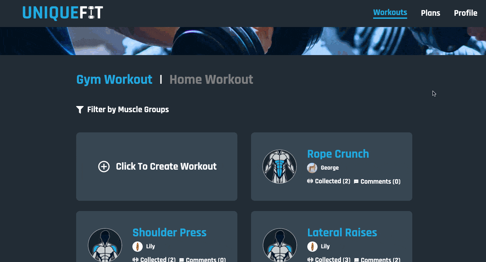

# Introduction

UniqueFit is a fitness-related social platform for users to have unprecedented fitness experience.

- Share or collect your favorite workouts with videos from the community and customize your unique training workout plans
- Schedule and track your training routines with well-organized calendar
- Search for nearby gyms information before training

## Demo Link

> ### [UNIQUEFIT website >>](https://uniquefit-william.web.app)

Please login with your email or social media account for full experiences

Test account is also availible below

- User: uniquefit@uniquefit.com
- Password: uniquefit123

## Technologies

#### Front-End

- ReactJS / Redux / React Redux / React Router
- Styled-Components
- Firebase
  - authentication
  - storage
  - firestore
  - hosting
  - cloud function

#### Main Packages

- React Beautiful DnD
- React Google Map API
- FullCalendar

#### Website Graphics

- SVG / Adobe Illustrator

#### Miscellaneous

- React Datepicker
- React Toastify
- AOS Animation
- ReactJS Popup
- React Progress Bar
- uuid
- moment

## User Flow Chart

## Features

- #### Filter workouts and plans with muscle group graphics
  
- #### Customize your training plans freely with your favorite workouts
  
- #### Share your fantastic workouts with UniqueFit community
  
- #### Checkout workouts published by others and collect whatever you like
  
- #### Checkout various plans and train with it
  
- #### Schedule your training routines with up to date records
  
- #### Find out your nearby gym easily as you wish
  

## Future Features

- Integrate workout plans with timer for more customized training experience
- Add user following system to interact more with favorite publishers
- Combine training calendar with nearby gyms map to offer more advanced training schedule planning
- Optimize training track with self-decided reviewing days
- More uploads within the community

## Contact Me

If you got any problem or suggestion with UniqueFit, please feel free to contact with me via email.

- Author: William Lin
- Email: williamlin330088@gmail.com
